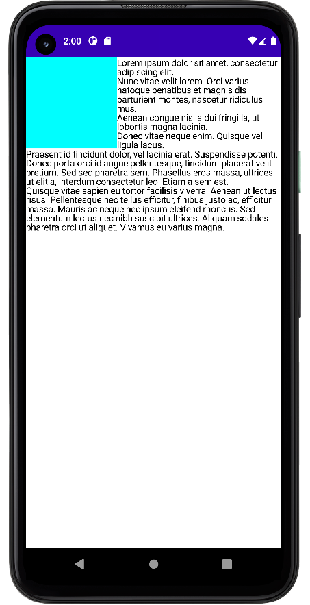
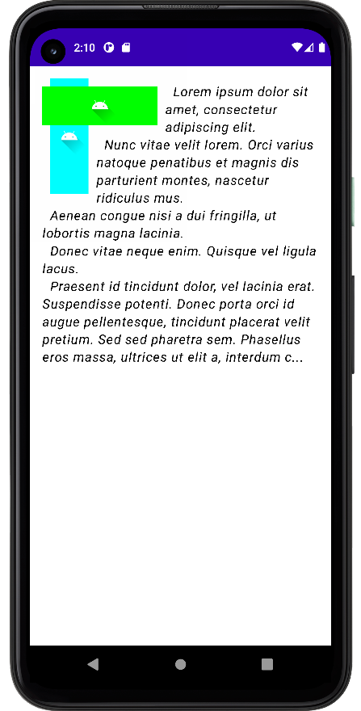
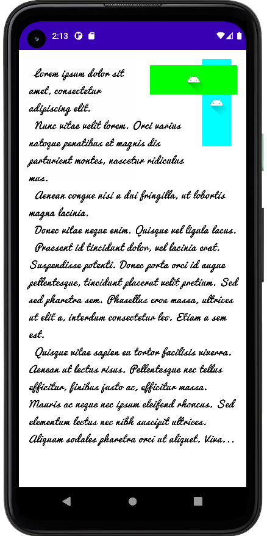

# TextAroundContent

Drawing text around other content in Jetpack Compose

## Installation

Step 1. Add the JitPack repository to your build file

```groovy
allprojects {
  repositories {
    ...
    mavenCentral()
  }
}
```

Step 2. Add the dependency

```groovy
dependencies {
   implementation "io.github.dmitrymysenko:textaroundcontent:0.1.0"
}
```

## Usage

```kotlin
TextAroundContent(text = "Some text  ..."){
  Box(modifier = Modifier.size(140.dp).background(color = Color.Cyan))
}
```

[](images/1.png)

## Customization

- color - Color to apply to the text. 
- paragraphSize - Indent after line break. Applies only if the text is TextAlign.Left. 
- fontSize - The size of glyphs to use when painting the text. 
- fontStyle - The typeface variant to use when drawing the letters. 
- typeface - Typeface to apply to the text. 
- letterSpacing - The amount of space to add between each letter. 
- textAlign - The alignment of the text within the lines of the paragraph. 
- lineHeight - Distance between baselines. 
- overflow - How visual overflow should be handled. 
- maxLines - An optional maximum number of lines for the text to span, wrapping if necessary. 
- alignContent - Align content to the left or right side. 

[](images/2.png)
[](images/3.png)

## License

    Copyright (c) 2021 Dmitry

    Licensed under the Apache License, Version 2.0 (the "License");
    you may not use this file except in compliance with the License.
    You may obtain a copy of the License at

       http://www.apache.org/licenses/LICENSE-2.0

    Unless required by applicable law or agreed to in writing, software
    distributed under the License is distributed on an "AS IS" BASIS,
    WITHOUT WARRANTIES OR CONDITIONS OF ANY KIND, either express or implied.
    See the License for the specific language governing permissions and
    limitations under the License.
